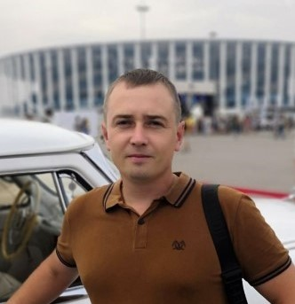

# Гурьяшов Александр Николаевич

> Я прохожу курс «Java-разработчик с нуля» подготовленый Нетологией в рамках государственной программы дополнительного образования «Цифровые профессии».

Освоенные мной блоки:
1. Основы Java по проекту «Цифровые профессии»
2. Git — система контроля версий

Блоки в процессе изучения:
1. Алгоритмы и структуры данных
2. Java Core
3. Шаблоны проектирования

_г. Нижний Новгород_
